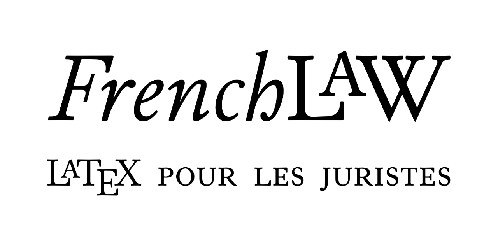

<h3>Frenchlaw: A versatile LaTeX class for lawyers</h3>
 

## Frenchlaw Project ##

### Version française ###

`Frenchlaw` se compose d'une classe et de plusieurs autres paquets pour LaTeX. Elle est destinée à faciliter l'écriture des juristes francophones, bien qu'un processus d'internationalisation soit en cours, notamment vers les juridictions anglo-saxonnes.

Ce projet est né des besoins d'écriture de ma thèse de doctorat.

L'objectif principal, pour l'heure, est de rédiger la documentation de la classe et, chemin faisant, de réordonner et de clarifier le code. Cela permettra (un jour) la publication officielle de cette classe.

Il s'agit d'un projet en cours de développement qui peut contenir (quelques) bugs et  comprend pas encore toutes ses fonctionnalités définitives. Toutes les questions et suggestions seront étudiées.

Si vous souhaitez utiliser ce logiciel ou contribuer à son développement, merci de prendre contact!

### English Version ###

`Frenchlaw` is a LaTeX class and a set of other useful packages and styles developed for use primarily by French lawyers, even though some degree of internationalisation is under way, esp. towards English-speaking jurisdictions.

It was first developed as a tool which I used in order to write my PhD dissertation.

The main project for the time being is to write a documentation and, in the process, reorder the code into something cleaner and easier to maintain. This will hopefully led to the publication of this class (eventually…)

Please note that this is a work in progress and that it may (does) contain occasional bugs and lack some of its functionalities. All requests and suggestions will, however, be studied, and any help is appreciated.

If you are interested in using the project or contributing to its development, please get in touch.

## LPPL Licence ##

### Version française ###

Le logiciel `Frenchlaw` est, en totalité, soumis à la LaTeX Project Public Licence (LPPL); il ne saurait être distribué ou modifié que suivant les termes stipulés dans la licence, version 1.3 ou ultérieure (celle-ci est incluse dans le dossier, pour information).

La dernière version de la LPPL peut être obtenue à l'adresse suivante : http://www.latex-project.org/lppl.txt

Ce logiciel a le statut "author-maintained" au sens de la LPPL.

**Auteur et mainteneur:** Flora VERN – ienissei (at) gmail (dot) com

Il comporte tous les documents présents sur ce dépôt Git, soit à ce jour :
- `documentation.tex`
- `documentation.pdf`
- `frenchlaw.cls`
- `frenchlaw.bib`
- `frenchlaw.bbx`
- `frenchlaw.cbx`
- `frenchlaw.dbx`
- `frenchlaw-en.lbx`
- `frenchlaw-fr.lbx`
- `frenchlaw.ist`
- `frenchlaw.xdy`
- `typographie.sty`
- `frenchlaw-babel.sty`
- `frenchlaw-dev.sty`
- `README.MD`

### English Version ###

The `Frenchlaw` software is subject to the LaTeX Project Public Licence (LPPL) and can only be distributed or modified according to the terms of versions 1.3 or later of that licence (which is included in the repository, for reference).

The latest version of this license can be found at http://www.latex-project.org/lppl.txt

This work has the LPPL status "author-maintained".

**Author and maintainer:** Flora VERN – ienissei (at) gmail (dot) com

It comprises all of the files present in this repository. At present, those files are:
- `documentation.tex`
- `documentation.pdf`
- `frenchlaw.cls`
- `frenchlaw.bib`
- `frenchlaw.bbx`
- `frenchlaw.cbx`
- `frenchlaw.dbx`
- `frenchlaw-en.lbx`
- `frenchlaw-fr.lbx`
- `frenchlaw.ist`
- `frenchlaw.xdy`
- `typographie.sty`
- `frenchlaw-babel.sty`
- `frenchlaw-dev.sty`
- `README.MD`

---

© 2009–2025 Fora VERN